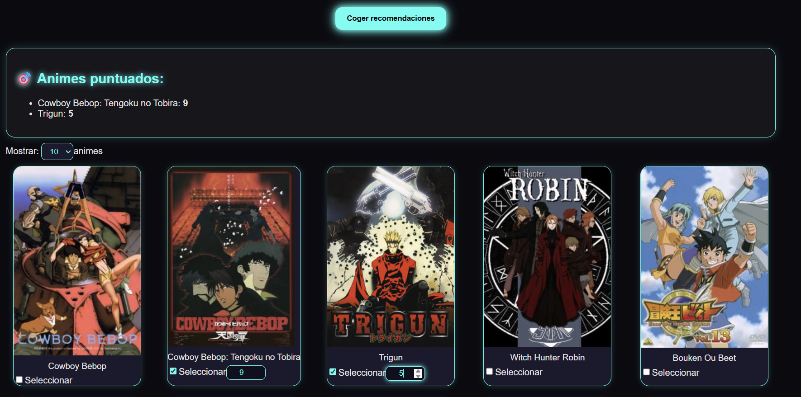
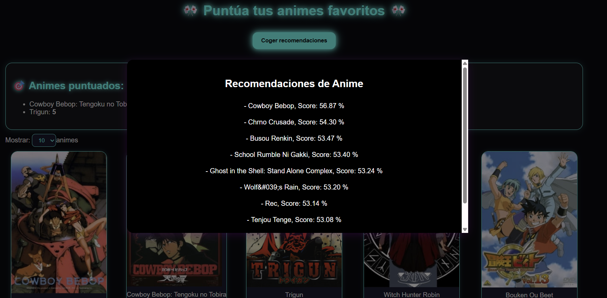

# 🎌 RecomendacionesAnime

Sistema de recomendaciones de anime basado en valoraciones de usuario, utilizando **Flask** (BackEnd) y **Vite + React** (FrontEnd).

---

## ⚙️ Iniciar BackEnd

1. Abrir un terminal dentro de la carpeta **`anime-back`**
2. Instalar las librerías necesarias:
   ```bash
   pip install -r requirements.txt
   ```
3. Iniciar el servidor BackEnd con:
   ```bash
   flask --app api.py run
   ```
4. El servidor se ejecutará por defecto en:
   ```bash
   http://127.0.0.1:5000
   ```

## 💻 Iniciar FrontEnd

1. Abrir un terminal dentro de la carpeta **`anime-front`**
2. Instalar las dependencias necesarias:
   ```bash
   npm i
   ```
3. Iniciar el servidor FrontEnd:
   ```bash
   npm run dev
   ```
4. Una vez iniciado, el comando anterior mostrará un enlace como el siguiente:
   ```bash
   http://localhost:5173/
   ```

## 🎮 Interactuar con la Web

1. Se mostrará una lista con varios animes disponibles.
2. Selecciona uno o varios animes y asigna una puntuación a cada uno (por defecto la puntuación es 0).
3. Haz clic en el botón “Coger recomendaciones”.
4. En pocos instantes, aparecerá un modal con tus recomendaciones personalizadas.
5. Si deseas obtener recomendaciones distintas:
   - Cierra el modal haciendo clic fuera de él.
   - Repite el proceso desde el paso 2.


🧩 Tecnologías Utilizadas
🔹 FrontEnd
   - Vite
   - React
   - Tailwind CSS (clases utilitarias básicas)
   - CSS personalizado con efectos neón y sombreado dinámico
   - Fetch API para llamadas al BackEnd y a la API de Jikan

🔹 Machine Learning

   El modelo implementa un sistema de recomendación colaborativa, que analiza las valoraciones de los usuarios para encontrar patrones y sugerir animes con características similares a los que ya te gustan.

🎨 Características del diseño

   - Interfaz visual tipo neón cyberpunk
   - Cartas de anime con imágenes grandes, bordes luminosos y hover animado
   - Disposición responsive mediante CSS Grid
   - Modal de recomendaciones con efectos brillantes y sombras dinámicas
   - Carga dinámica de animes desde la API (paginación por límite configurable)
   - pandas y numpy para manejo de datos
      
🖼️ Vista previa


  

   Seleccion de animes a recomendar por el uruario: 

  

  A partir de los animes que se han seleccionado, la recomendacion es la siguiente : 

  